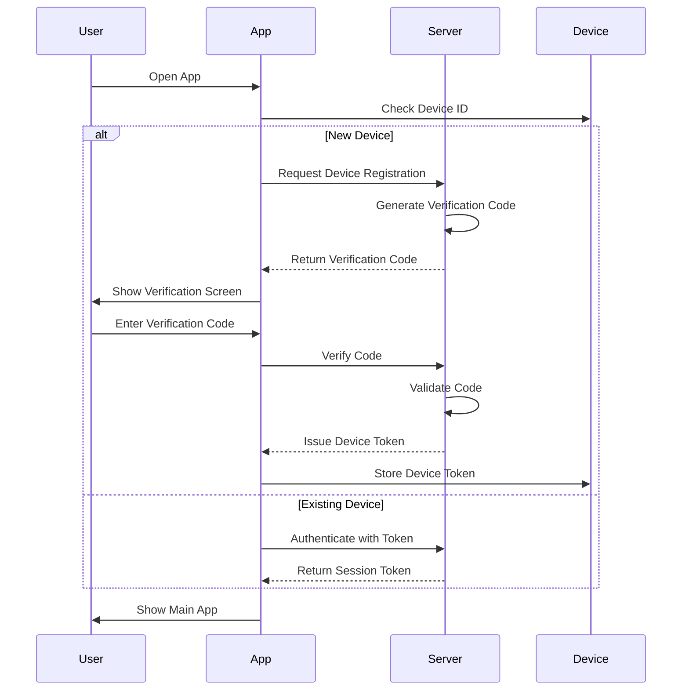

# Device Configuration & Authentication

## 📱 Device Management System

### 1. Device Registration Flow



### 2. Device Configuration Tables

#### 2.1 device_configurations
```sql
CREATE TABLE device_configurations (
    id VARCHAR(36) PRIMARY KEY,
    university_id VARCHAR(36) NOT NULL,
    device_id VARCHAR(255) NOT NULL,
    user_id VARCHAR(36) NOT NULL,
    device_name VARCHAR(100),
    device_model VARCHAR(100),
    os_version VARCHAR(50),
    app_version VARCHAR(20),
    last_active_at TIMESTAMP,
    is_active BOOLEAN DEFAULT TRUE,
    sync_status VARCHAR(20) DEFAULT 'synced',
    created_at TIMESTAMP DEFAULT CURRENT_TIMESTAMP,
    updated_at TIMESTAMP DEFAULT CURRENT_TIMESTAMP,
    UNIQUE(device_id, university_id)
);
```

#### 2.2 device_registrations
```sql
CREATE TABLE device_registrations (
    id VARCHAR(36) PRIMARY KEY,
    university_id VARCHAR(36) NOT NULL,
    device_id VARCHAR(255) NOT NULL,
    verification_code VARCHAR(6) NOT NULL,
    expires_at TIMESTAMP NOT NULL,
    is_used BOOLEAN DEFAULT FALSE,
    created_at TIMESTAMP DEFAULT CURRENT_TIMESTAMP
);
```

### 3. Authentication Flow

#### 3.1 Initial Setup
1. User installs the app
2. App generates a unique device ID
3. User selects their university
4. App initiates device registration
5. Verification code is sent to university email
6. User enters verification code
7. Device is registered and receives authentication tokens

#### 3.2 Login Flow
1. User opens the app
2. App checks for existing device token
3. If token exists, validate with server
4. If valid, grant access
5. If invalid, start re-authentication

### 4. Security Measures

#### 4.1 Device Fingerprinting
- Device ID generation
- Hardware identifiers
- Software environment
- Network information

#### 4.2 Token Management
- JWT for authentication
- Refresh token rotation
- Token expiration
- Token revocation

### 5. Multi-Device Support

#### 5.1 Device Management
- View active devices
- Revoke device access
- Session management
- Activity logs

#### 5.2 Data Synchronization
- Conflict resolution
- Last-write-wins strategy
- Manual merge for critical data

### 6. Error Handling

#### 6.1 Common Issues
- Invalid device token
- Expired session
- Network connectivity
- Version mismatch

#### 6.2 Recovery Flows
- Token refresh
- Re-authentication
- Device re-registration
- Support contact

## 🔐 Security Considerations

### 1. Data Protection
- Encrypted local storage
- Secure token storage
- Biometric authentication
- Remote wipe capability

### 2. Network Security
- Certificate pinning
- TLS 1.3
- Secure WebSockets
- Rate limiting

### 3. Compliance
- GDPR compliance
- Data retention policies
- Audit logging
- Privacy controls

## 📱 Platform-Specific Configuration

### 1. Android
- WorkManager for background sync
- Foreground services
- Doze mode optimization
- Battery optimization

### 2. iOS
- Background app refresh
- Push notification handling
- App groups for extensions
- Keychain for secure storage

## 🔄 Synchronization

### 1. Offline Support
- Local database (SQLite)
- Queue for pending operations
- Conflict resolution
- Sync status indicators

### 2. Background Sync
- Periodic sync
- Push notifications
- Manual sync trigger
- Bandwidth optimization

## 📊 Monitoring & Analytics

### 1. Device Metrics
- Active devices
- Session duration
- Crash reports
- Performance metrics

### 2. Usage Statistics
- Feature usage
- Common actions
- Error rates
- User engagement

## 🚀 Implementation Guide

### 1. Setup Instructions
```bash
# Clone the repository
git clone https://github.com/your-org/school-management-app.git

# Install dependencies
flutter pub get

# Configure environment variables
cp .env.example .env

# Run the app
flutter run
```

### 2. Configuration Options
```dart
// Device configuration
const deviceConfig = {
  'syncInterval': Duration(minutes: 15),
  'maxRetryAttempts': 3,
  'offlineStorageLimit': '100MB',
  'enableAnalytics': true,
  'enableCrashReporting': true,
};
```

### 3. Troubleshooting

#### Common Issues
1. **Device not registering**
   - Check network connectivity
   - Verify university email domain
   - Check spam folder for verification code

2. **Sync failures**
   - Check device time settings
   - Verify authentication tokens
   - Check server status

3. **App crashes**
   Clear app data and cache
   Reinstall the app
   Update to the latest version

## 📝 Support

For assistance, contact:
- Email: support@schoolmanagement.com
- Phone: +1 (555) 123-4567
- Help Center: https://help.schoolmanagement.com
