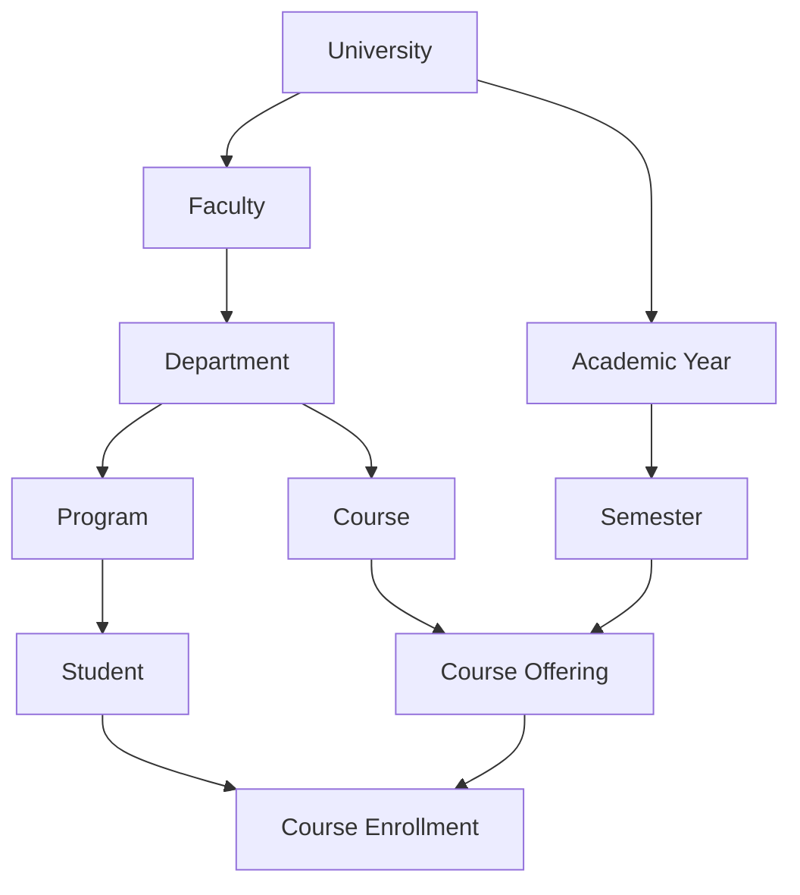

# Database Schema Documentation

## 📊 Complete Database Structure

This folder contains the complete database schema for the **School Management System**, including both **MySQL (Laravel API)** and **SQLite (Flutter App)** versions.

---

## 📂 Schema Files

All 48 tables are organized into 9 category files:

### [01_INSTITUTIONAL_TABLES.md](01_INSTITUTIONAL_TABLES.md)
Core institutional structure tables (4 tables):
- `universities` - University master data
- `faculties` - Faculty/College definitions
- `departments` - Academic departments
- `programs` - Degree programs

### [02_ACADEMIC_PERIODS.md](02_ACADEMIC_PERIODS.md)
Academic time periods (2 tables):
- `academic_years` - Academic year definitions
- `semesters` - Semester/term definitions with registration periods

### [03_USER_MANAGEMENT.md](03_USER_MANAGEMENT.md)
User and authentication tables (5 tables):
- `users` - Base user table for all user types
- `administrators` - Admin-specific data and permissions
- `teachers` - Teacher profiles and employment data
- `students` - Student enrollment and academic data
- `user_sessions` - Session tracking and JWT tokens

### [04_DEVICE_AUTH.md](04_DEVICE_AUTH.md)
Device configuration and authentication (3 tables):
- `device_configurations` - Device-to-university bindings
- `device_registrations` - Device verification codes
- `pending_accounts` - New account approval queue

### [05_COURSES.md](05_COURSES.md)
Course management tables (4 tables):
- `courses` - Course master definitions
- `course_offerings` - Semester-specific course instances
- `course_enrollments` - Student enrollment records
- `course_prerequisites` - Course prerequisite relationships

### [06_ASSIGNMENTS.md](06_ASSIGNMENTS.md)
Assignment and submission tables (5 tables):
- `assignments` - Assignment definitions
- `assignment_submissions` - Student submissions
- `assignment_questions` - Quiz/exam questions
- `assignment_rubrics` - Grading rubrics
- `submission_files` - File attachments for submissions

### [07_GRADING_ATTENDANCE.md](07_GRADING_ATTENDANCE.md)
Grading and attendance tracking (6 tables):
- `grades` - Individual grade records
- `grade_categories` - Grade category weights (midterm, final, etc.)
- `grade_scales` - Grading scales and GPA mappings
- `class_sessions` - Individual class meetings
- `attendance_records` - Student attendance tracking
- `attendance_excuses` - Absence excuse requests

### [08_COMMUNICATION_DOCS.md](08_COMMUNICATION_DOCS.md)
Communication and document management (8 tables):
- `messages` - Direct messaging between users
- `announcements` - System and course announcements
- `notifications` - User notifications
- `message_attachments` - Message file attachments
- `document_folders` - Folder structure for documents
- `documents` - Document/file storage
- `course_materials` - Course-specific learning materials
- `document_downloads` - Download tracking and analytics

### [09_FINANCE_PAYMENT.md](09_FINANCE_PAYMENT.md)
Finance and payment management (10 tables):
- `financial_accounts` - User wallet and account balances
- `transactions` - All financial transactions
- `transaction_categories` - Transaction categorization
- `payment_methods` - User payment methods
- `document_payments` - Paid document access tracking
- `tuition_fees` - Student tuition billing
- `fee_payments` - Tuition payment records
- `payment_plans` - Installment payment plans
- `financial_history` - Complete financial audit trail
- `withdrawal_requests` - Money withdrawal requests

---

## 🔑 Key Design Features

### Multi-Tenant Architecture
- All tables include `university_id` for data isolation
- Foreign key constraints enforce referential integrity
- University-scoped unique constraints

### Offline-First Design
Every table includes sync metadata fields:
```sql
-- MySQL
sync_status VARCHAR(20) DEFAULT 'synced',
sync_version INT DEFAULT 1,
is_dirty BOOLEAN DEFAULT FALSE,
last_synced_at TIMESTAMP NULL,
conflict_data JSON NULL,

-- SQLite
sync_status TEXT DEFAULT 'synced',
sync_version INTEGER DEFAULT 1,
is_dirty INTEGER DEFAULT 0,
last_synced_at TEXT,
conflict_data TEXT,
```

### Hierarchical Structure
The database implements a complete academic hierarchy:
```
University
  └── Faculty
      └── Department
          └── Program
              └── Academic Year
                  └── Semester
                      └── Course Offering
                          └── Enrollment
```

### Role-Based Access Control (RBAC)
- Three primary user types: **Admin**, **Teacher**, **Student**
- Polymorphic user relationships via `users` base table
- Role-specific tables with extended attributes

---

## 🗂️ Table Count Summary

| Category | Tables | Description |
|----------|--------|-------------|
| **Institutional** | 4 | University, Faculty, Department, Program |
| **Academic Periods** | 2 | Academic Years, Semesters |
| **User Management** | 5 | Users, Admins, Teachers, Students, Sessions |
| **Device & Auth** | 3 | Device Configuration, Registration, Pending Accounts |
| **Courses** | 4 | Courses, Offerings, Enrollments, Prerequisites |
| **Assignments** | 5 | Assignments, Submissions, Questions, Rubrics, Files |
| **Grading & Attendance** | 6 | Grades, Categories, Scales, Sessions, Records, Excuses |
| **Communication & Docs** | 8 | Messages, Announcements, Notifications, Documents |
| **TOTAL** | **38** | Complete database schema |

---

## 🔗 Entity Relationships

### Core Relationships



### User Type Relationships

```
users (base table)
  ├── administrators
  ├── teachers
  └── students
```

### Assignment Flow

```
course_offering
  └── assignments
      ├── assignment_questions
      ├── assignment_rubrics
      └── assignment_submissions
          └── submission_files
```

---

## 📋 Implementation Checklist

### Phase 1: Core Structure ✅
- [x] Create institutional tables
- [x] Create academic period tables
- [x] Create user management tables
- [x] Create device authentication tables

### Phase 2: Academic Operations ✅
- [x] Create course tables
- [x] Create assignment tables
- [x] Create grading tables
- [x] Create attendance tables

### Phase 3: Communication ✅
- [x] Create messaging tables
- [x] Create notification tables
- [x] Create document management tables

### Phase 4: Migration Files (Next Steps)
- [ ] Generate Laravel migration files (38 files)
- [ ] Create Flutter SQLite initialization
- [ ] Create Eloquent models with relationships
- [ ] Create Dart model classes

### Phase 5: Data Layer (Next Steps)
- [ ] Implement repository pattern
- [ ] Create API endpoints
- [ ] Implement sync service
- [ ] Add sample data seeders

---

## 🚀 Quick Start

### For Laravel (MySQL):
1. Copy SQL from each file's MySQL section
2. Create migration files in `database/migrations/`
3. Run: `php artisan migrate`

### For Flutter (SQLite):
1. Copy SQL from each file's SQLite section
2. Add to `database_service.dart` initialization
3. Run database creation on first app launch

---

## 📖 Additional Documentation

- **Main Project README**: [../../README.md](../../README.md)
- **Architecture Overview**: [../ARCHITECTURE.md](../ARCHITECTURE.md) *(to be created)*
- **API Specification**: [../API_SPECIFICATION.md](../API_SPECIFICATION.md) *(to be created)*
- **Sync Documentation**: [../SYNC_STRATEGY.md](../SYNC_STRATEGY.md) *(to be created)*

---

## 🔧 Database Design Principles

1. **Normalization**: All tables are in 3NF (Third Normal Form)
2. **Referential Integrity**: Foreign keys enforce data consistency
3. **Indexing**: Strategic indexes on frequently queried columns
4. **Timestamps**: All tables include `created_at` and `updated_at`
5. **Soft Deletes**: Can be added via `deleted_at` column if needed
6. **UUID Primary Keys**: VARCHAR(36) for distributed system compatibility

---

**Last Updated**: 2024-10-05
**Schema Version**: 1.0.0
**Total Tables**: 38
**Status**: Complete ✅
